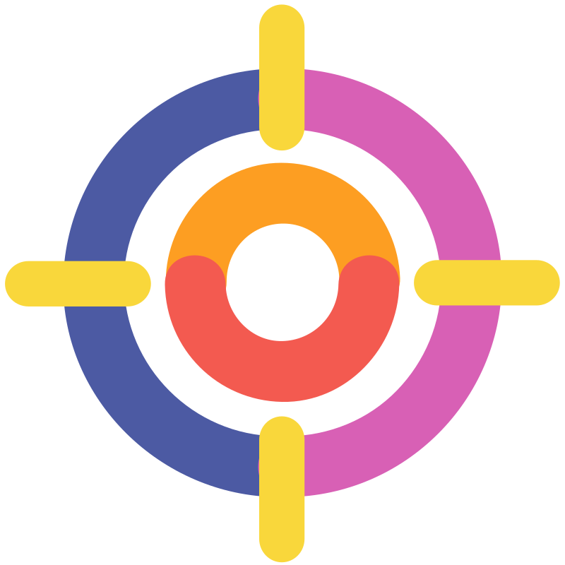
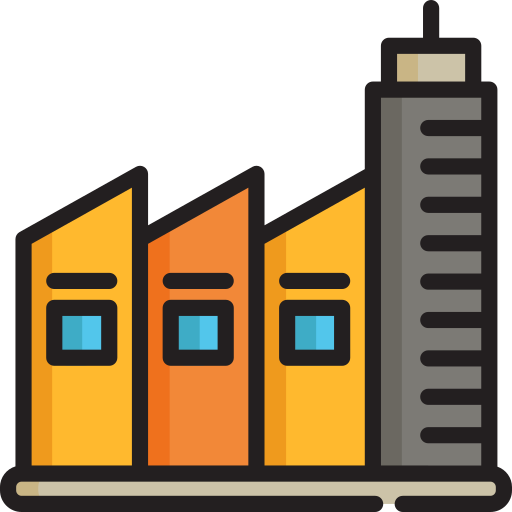
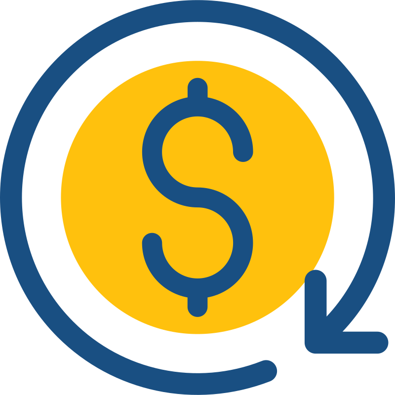
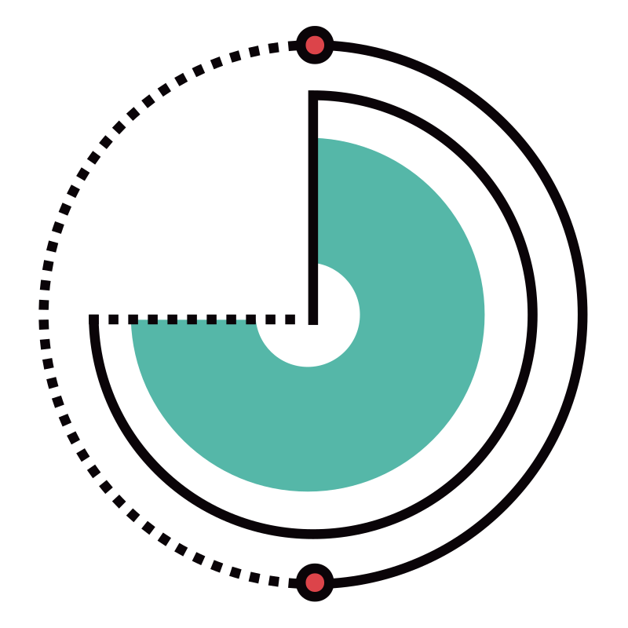
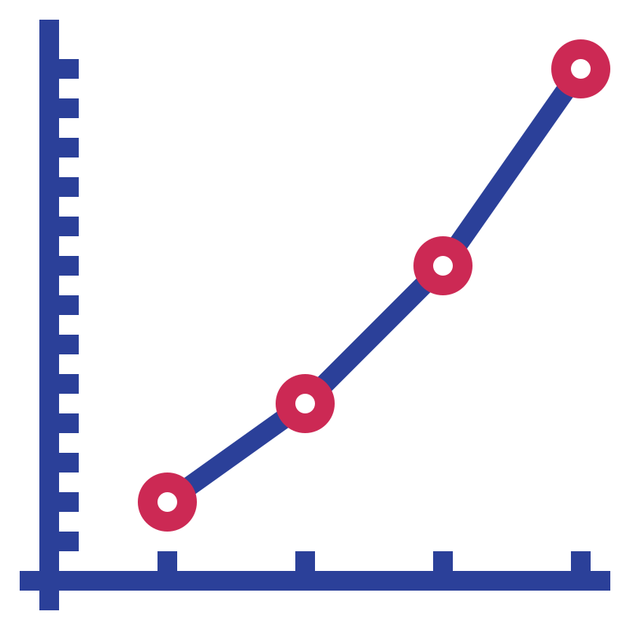
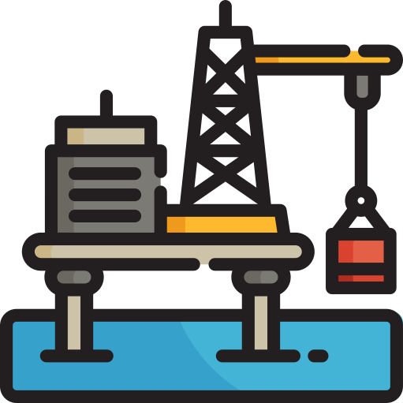
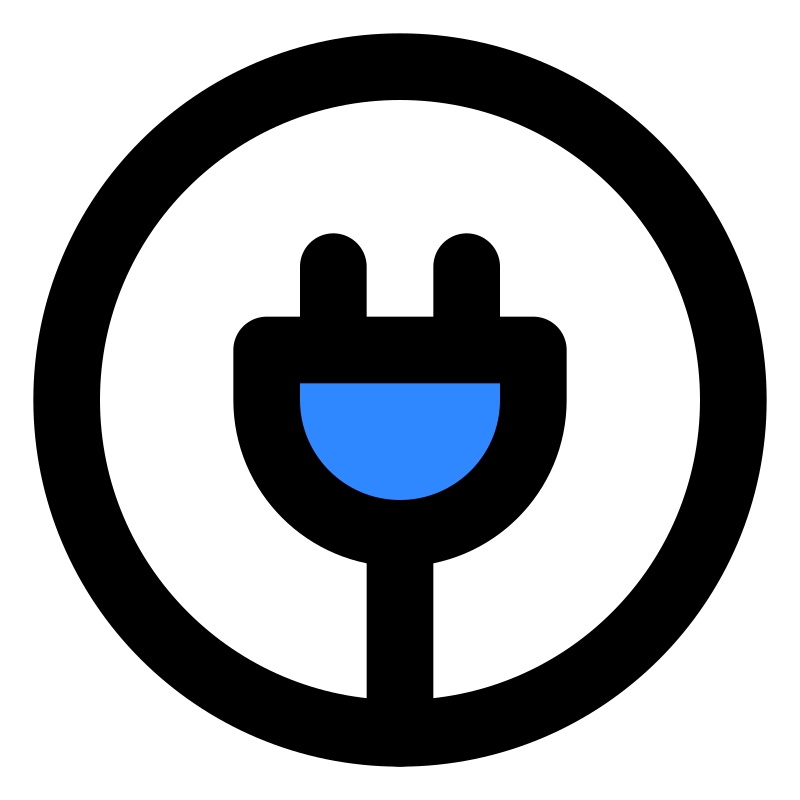
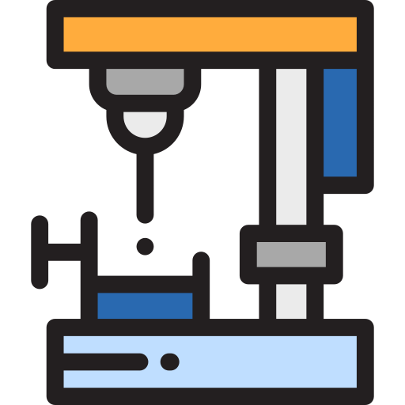
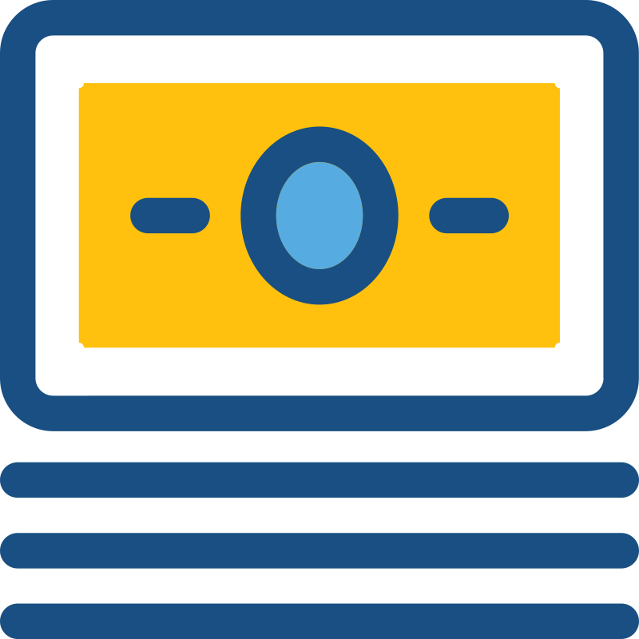

# Varun Nidhi | Building Successful AI Systems

##  Delivering Production-Ready AI Solutions for Enterprise

Transform your business with **privacy-first, scalable AI applications**. Specializing in industrial automation, and intelligent monitoring systems.

** <a href="https://www.linkedin.com/in/varunnidhi" target="_blank" rel="noopener noreferrer">LinkedIn</a>**

---

##  Why Work With Me

** Industrial AI Expertise**: Proven track record implementing AI solutions for manufacturing and energy sectors  
** Privacy-First Architecture**: All solutions support on-premise deployment and data sovereignty  
** Rapid Deployment**: From concept to production in weeks, not months  
** Cost-Effective**: Flexible deployment options (cloud/local) to optimize your TCO  

---

##  Featured Open Source Projects

<table>
<tr>
<td width="50%" valign="top">

### **Enterprise Document Automation**
####  Prompt2PowerPoint

**Transform Ideas into Professional Presentations**

**Problem**: Teams waste 2-3 hours per presentation
**Solution**: AI-powered PPTX generation with brand consistency
**ROI**: 80% reduction in deck creation time

 **<a href="https://van007.github.io/Prompt2Powerpoint/" target="_blank" rel="noopener noreferrer">Try Demo</a>** | <a href="https://github.com/van007/Prompt2Powerpoint" target="_blank" rel="noopener noreferrer">Source</a>

**Key Features:**
 Multi-deployment (Cloud/On-premise)
 Brand compliance & templates
 Document intelligence (PDFs)
 Stock asset integration
 Zero IT overhead

**For**: Sales, consulting, marketing, executives

</td>
<td width="50%" valign="top">

### **Industrial IoT Monitoring**
####  Solar-AI

**Intelligent Solar Plant Management System**

**Problem**: 20-30% efficiency losses from reactive maintenance
**Solution**: Real-time monitoring with predictive detection
**ROI**: 25% increase in operational efficiency

 **<a href="https://van007.github.io/Solar-AI/" target="_blank" rel="noopener noreferrer">Try Demo</a>** | <a href="https://github.com/van007/Solar-AI" target="_blank" rel="noopener noreferrer">Source</a>

**Key Features:**
 Predictive maintenance AI
 Real-time dashboard
 Intelligent alerts
 Historical analytics
 AI assistant integration

**For**: Energy operators, facility managers

</td>
</tr>
<tr>
<td width="50%" valign="top">

### **Business Process Automation**
####  QR Code Generator

**Enterprise-Grade QR Solutions**

**Problem**: Need quick, branded QR codes for campaigns
**Solution**: Professional QR generator with full customization
**ROI**: Instant QR generation with batch capabilities

 **<a href="https://van007.github.io/QR-Code-Generator/" target="_blank" rel="noopener noreferrer">Try Tool</a>** | <a href="https://github.com/van007/QR-Code-Generator" target="_blank" rel="noopener noreferrer">Source</a>

**Key Features:**
 9 business formats
 Brand customization
 High-volume support
 Multiple export formats
 Error correction (L/M/Q/H)

**For**: Marketing, events, retail, operations

</td>
<td width="50%" valign="top">

### **Coming Soon**
####  Next Project

**Stay tuned for more innovative AI solutions!**

Working on new tools for:
- Data analytics automation
- Intelligent document processing
- Real-time decision support systems

 **Follow for updates**

</td>
</tr>
</table>

---

##  Expertise

### **Custom AI Development**
 **LLM Integration**: OpenAI, Anthropic, open-source models  
 **Data Pipeline Architecture**: ETL, real-time processing, analytics  
 **Industrial IoT**: Sensor integration, predictive maintenance, quality control  
 **Business Intelligence**: Dashboards, reporting, KPI automation  

### **Technology Stack**  
**Frontend**: HTML, JS, Progressive Web Apps  
**Backend**: Node.js, Python, RESTful APIs  
**AI/ML**: TensorFlow, PyTorch, Hugging Face  
**Cloud**: AWS, Azure, Google Cloud, Kubernetes  
**Data**: PostgreSQL, MongoDB, Redis, Elasticsearch  

---

##  Industries Served

 **Oil & Gas** |  **Energy & Utilities** |  **Manufacturing**  
 **Healthcare** |  **Financial Services** |  **Retail & E-commerce**  

---

##  Let's Build Your Next AI Solution

Whether you need to:
- Automate workflows
- Implement predictive maintenance
- Build custom AI applications
- Modernize legacy systems

###  Quick Contact
** LinkedIn**: <a href="https://www.linkedin.com/in/varunnidhi" target="_blank" rel="noopener noreferrer">Varun Nidhi</a>  
** GitHub**: <a href="https://github.com/van007" target="_blank" rel="noopener noreferrer">van007</a>  

---

*Building the future of work with intelligent, privacy-conscious AI solutions.*

** Star my repos if you find them valuable |  Follow for updates on new tools**