# Varun Nidhi | Building Successful AI Systems

## 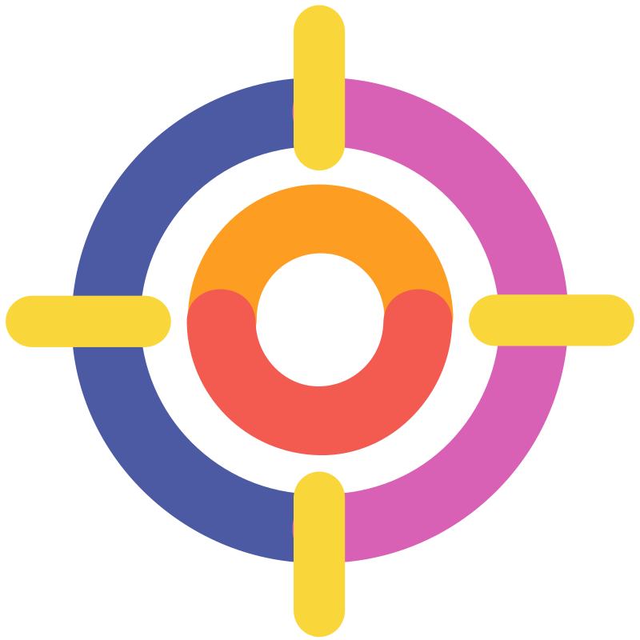 Delivering Production-Ready AI Solutions for Enterprise

Transform your business with **privacy-first, scalable AI applications**.

** <a href="https://www.linkedin.com/in/varunnidhi" target="_blank" rel="noopener noreferrer">LinkedIn</a>**

---

##  Why Work With Me

**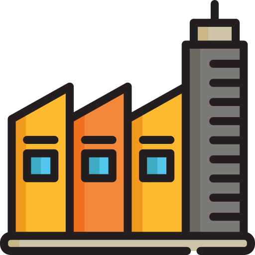 Industrial AI Expertise**: Proven track record implementing AI solutions
** Privacy-First Architecture**: All solutions support on-premise deployment and data sovereignty
** Rapid Deployment**: From concept to production in weeks, not months
**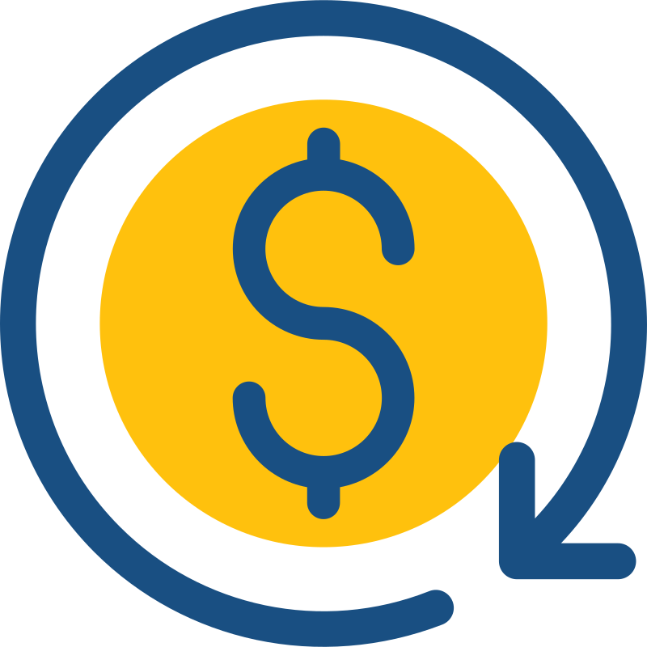 Cost-Effective**: Flexible deployment options (cloud/local) to optimize your TCO

---

## 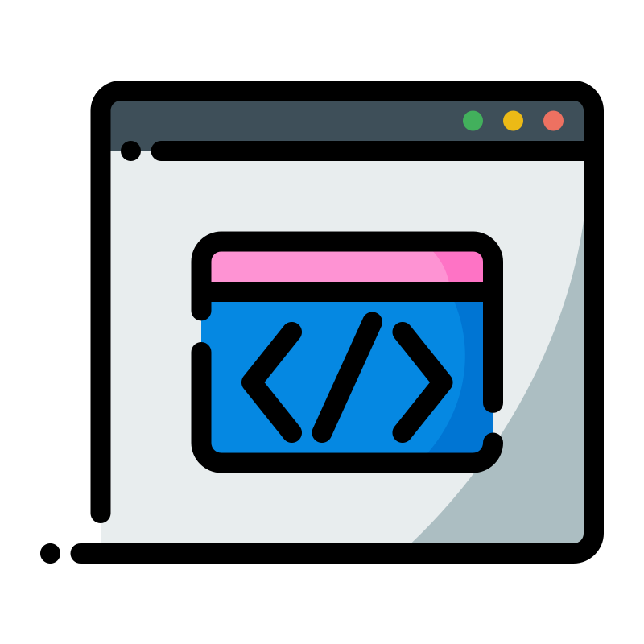 Technology Stack

                                          

---

##  Featured Open Source Projects

###  LLM-on-Web

  

> Run AI models directly in your browser with WebGPU acceleration — no server, complete privacy

---

###  QR Code Generator

  

> Enterprise-grade QR generator with 12+ types, full customization, and offline PWA support

---

###  Prompt2PowerPoint

  

> AI-powered presentation generation — transform prompts into professional PPTX in seconds

---

###  QuickTag-Images

  

> AI-powered image labeling and metadata management — process 10,000+ images locally

---

###  Solar-AI

  

> Intelligent solar plant monitoring with predictive maintenance AI and real-time analytics

---

##  Expertise

 **LLM Integration** &nbsp;&nbsp; 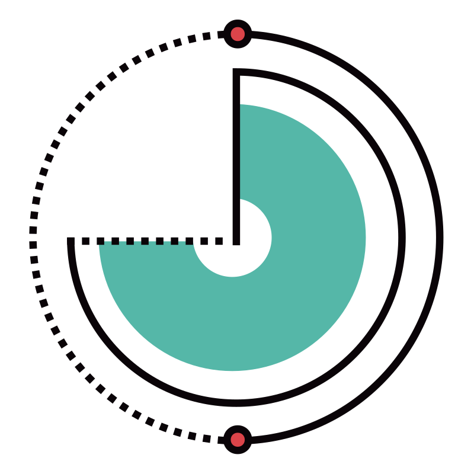 **Data Pipelines** &nbsp;&nbsp;  **Industrial IoT** &nbsp;&nbsp; 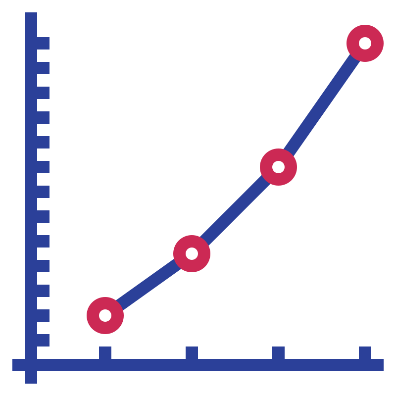 **Business Intelligence**

---

##  Industries Served

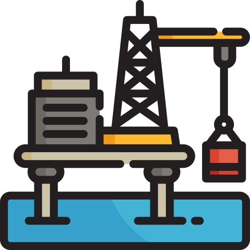 **Oil & Gas** &nbsp;&nbsp; 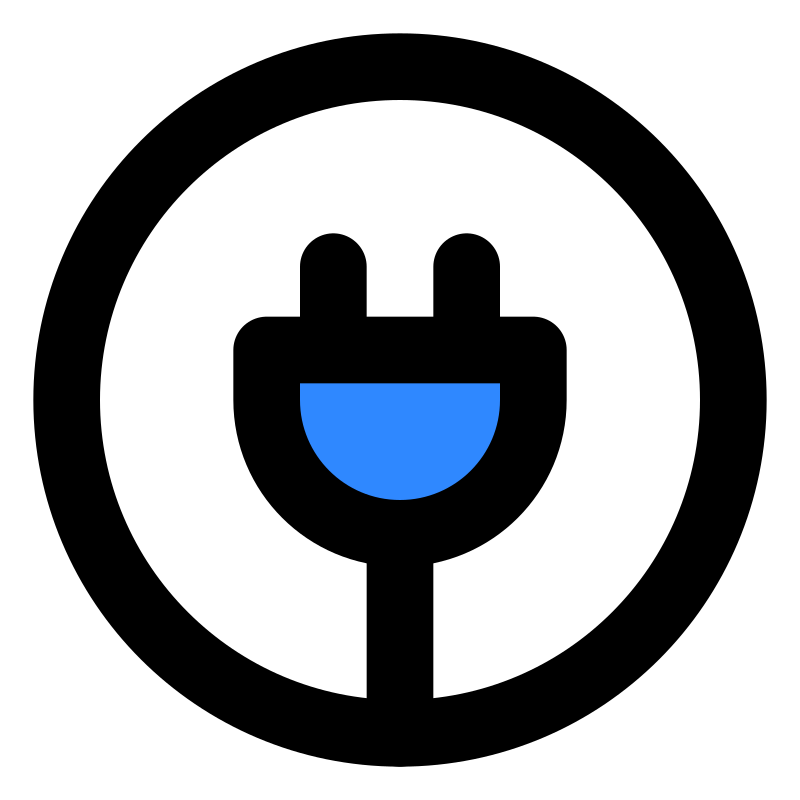 **Energy & Utilities** &nbsp;&nbsp; 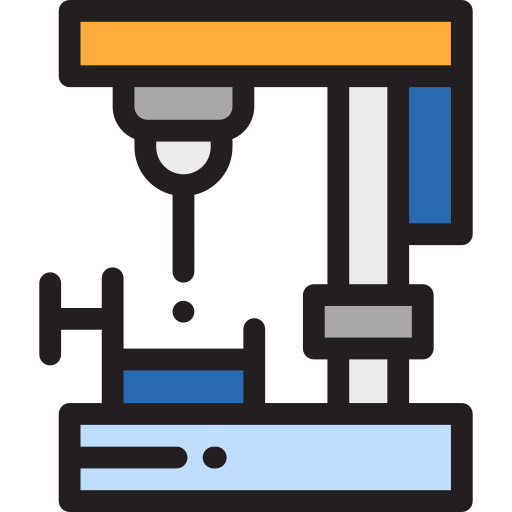 **Manufacturing** &nbsp;&nbsp; 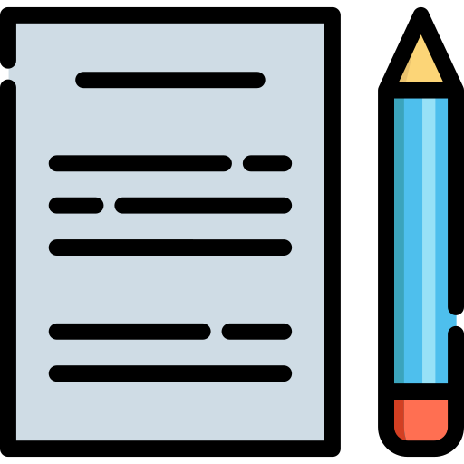 **Education** &nbsp;&nbsp;  **Healthcare** &nbsp;&nbsp; 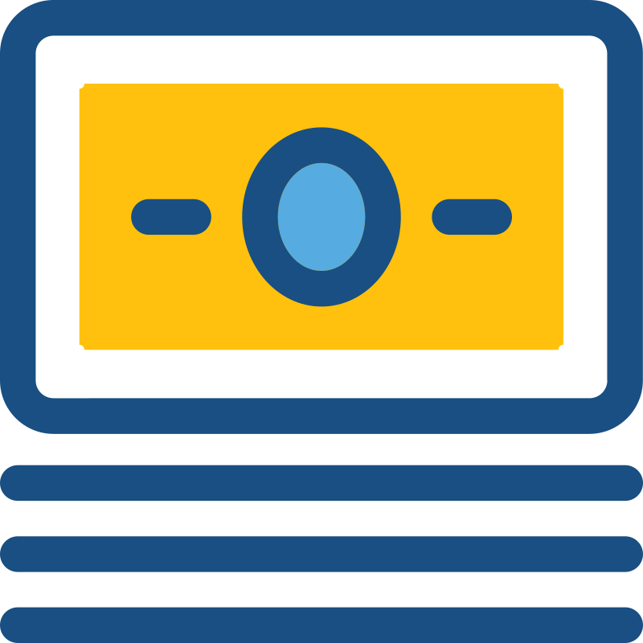 **Financial Services** &nbsp;&nbsp; 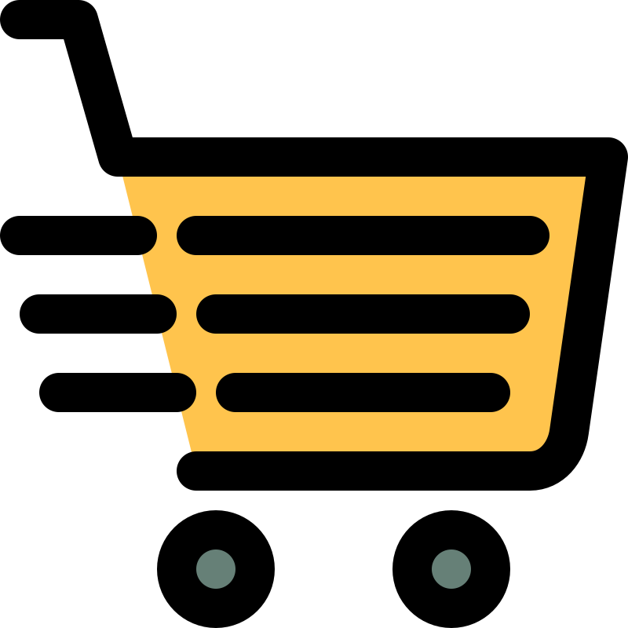 **Retail & E-commerce** &nbsp;&nbsp; 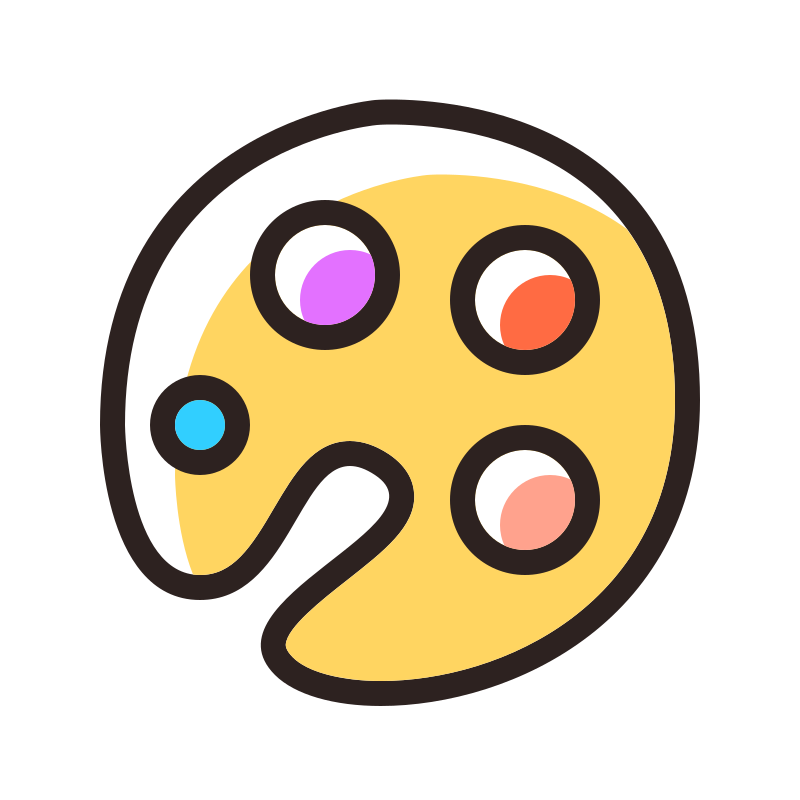 **Arts & Culture**  

---

##  Let's Build Your Next AI Solution

Whether you need to:  
 Automate workflows  
 Implement predictive maintenance  
 Build custom AI applications  
 Modernize legacy systems  

###  Quick Contact
** LinkedIn**: <a href="https://www.linkedin.com/in/varunnidhi" target="_blank" rel="noopener noreferrer">Varun Nidhi</a>  
** GitHub**: <a href="https://github.com/van007" target="_blank" rel="noopener noreferrer">van007</a>  

---

*Building the future of work with intelligent, privacy-conscious AI solutions.*

** Star my repos if you find them valuable |  Follow for updates on new tools**