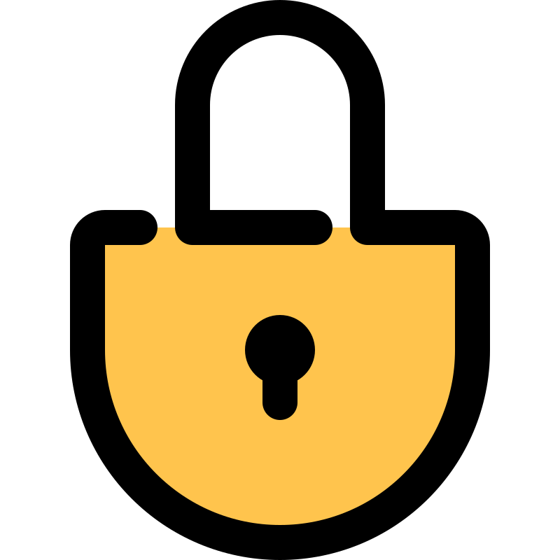
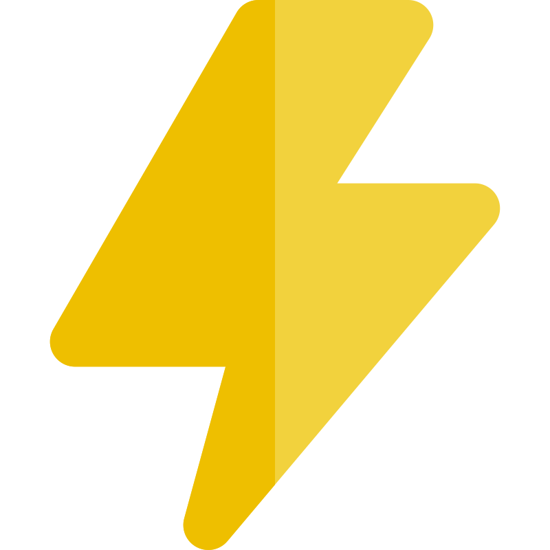
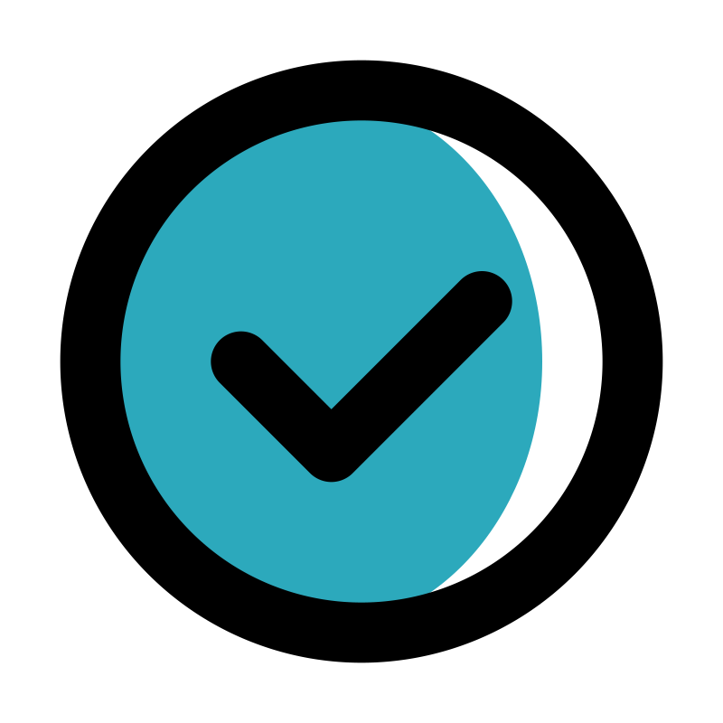
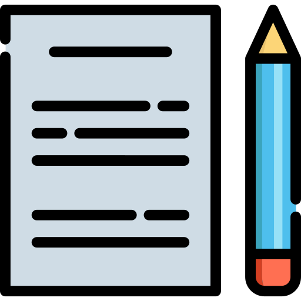

# Varun Nidhi | Building Successful AI Systems

##  Delivering Production-Ready AI Solutions for Enterprise

Transform your business with **privacy-first, scalable AI applications**. Specializing in industrial automation, and intelligent monitoring systems.

** <a href="https://www.linkedin.com/in/varunnidhi" target="_blank" rel="noopener noreferrer">LinkedIn</a>**

---

##  Why Work With Me

** Industrial AI Expertise**: Proven track record implementing AI solutions for manufacturing and energy sectors  
** Privacy-First Architecture**: All solutions support on-premise deployment and data sovereignty  
** Rapid Deployment**: From concept to production in weeks, not months  
** Cost-Effective**: Flexible deployment options (cloud/local) to optimize your TCO  

---

##  Featured Open Source Projects

<table>
<tr>
<td width="50%" valign="top">

### **Privacy-First Browser AI**
###  LLM-on-Web

**Run AI Models Directly in Your Browser - No Server Required**

**Problem**: Privacy concerns with cloud AI & server dependency
**Solution**: 100% browser-based AI with RAG capabilities
**ROI**: Complete privacy with zero server costs

 **<a href="https://van007.github.io/LLM-on-Web/" target="_blank" rel="noopener noreferrer">Try Demo</a>** | <a href="https://github.com/van007/LLM-on-Web" target="_blank" rel="noopener noreferrer">Source</a>

**Key Features:**
 WebGPU acceleration & offline support
 Document analysis (TXT, MD, PDF, HTML, JSON)
 Text-to-Speech with streaming
 Installable PWA
 Data never leaves your device

**For**: Privacy-conscious users, developers, researchers

</td>
<td width="50%" valign="top">

### **Business Process Automation**
###  QR Code Generator

**Enterprise-Grade QR Solutions**

**Problem**: Need quick, branded QR codes for campaigns
**Solution**: Professional QR generator with full customization
**ROI**: Instant QR generation with batch capabilities

 **<a href="https://van007.github.io/QR-Code-Generator/" target="_blank" rel="noopener noreferrer">Try Tool</a>** | <a href="https://github.com/van007/QR-Code-Generator" target="_blank" rel="noopener noreferrer">Source</a>

**Key Features:**
 12+ QR types (URL, Email, WiFi, vCard, UPI, AR)
 5 module shapes & color customization
 PWA with offline support
 Multiple exports (PNG, SVG, print, clipboard)
 Dark/Light themes & keyboard shortcuts

**For**: Marketing, events, retail, operations

</td>
</tr>
<tr>
<td width="50%" valign="top">

### **Enterprise Document Automation**
###  Prompt2PowerPoint

**Transform Ideas into Professional Presentations**

**Problem**: Teams waste 2-3 hours per presentation
**Solution**: AI-powered PPTX generation with brand consistency
**ROI**: 80% reduction in deck creation time

 **<a href="https://van007.github.io/Prompt2Powerpoint/" target="_blank" rel="noopener noreferrer">Try Demo</a>** | <a href="https://github.com/van007/Prompt2Powerpoint" target="_blank" rel="noopener noreferrer">Source</a>

**Key Features:**
 Multi-deployment (Cloud/On-premise)
 Brand compliance & templates
 Document intelligence (PDFs)
 Stock asset integration
 Zero IT overhead

**For**: Sales, consulting, marketing, executives

</td>
<td width="50%" valign="top">

### **Image Management & AI Labeling**
###  QuickTag-Images

**Transform Image Collections with Intelligent Organization**

**Problem**: Unorganized image collections difficult to search
**Solution**: AI-powered image labeling and metadata management
**ROI**: Process 10,000+ images with intelligent organization

 **<a href="https://van007.github.io/QuickTag-Images/" target="_blank" rel="noopener noreferrer">Try Demo</a>** | <a href="https://github.com/van007/QuickTag-Images" target="_blank" rel="noopener noreferrer">Source</a>

**Key Features:**
 Multi-folder processing
 AI-powered labeling
 Intelligent renaming
 Metadata embedding
 Privacy-first (local AI)

**For**: Photographers, designers, archivists, businesses

</td>
</tr>
<tr>
<td width="50%" valign="top">

### **Industrial IoT Monitoring**
###  Solar-AI

**Intelligent Solar Plant Management System**

**Problem**: 20-30% efficiency losses from reactive maintenance
**Solution**: Real-time monitoring with predictive detection
**ROI**: 25% increase in operational efficiency

 **<a href="https://van007.github.io/Solar-AI/" target="_blank" rel="noopener noreferrer">Try Demo</a>** | <a href="https://github.com/van007/Solar-AI" target="_blank" rel="noopener noreferrer">Source</a>

**Key Features:**
 Predictive maintenance AI
 Real-time dashboard
 Intelligent alerts
 Historical analytics
 AI assistant integration

**For**: Energy operators, facility managers

</td>
<td width="50%" valign="top">

</td>
</tr>
</table>

---

##  Expertise

<table>
<tr>
<td width="50%" valign="top">

### **Custom AI Development**

 **LLM Integration**
OpenAI, Anthropic, open-source models

 **Data Pipeline Architecture**
ETL, real-time processing, analytics

 **Industrial IoT**
Sensor integration, predictive maintenance, quality control

 **Business Intelligence**
Dashboards, reporting, KPI automation

</td>
<td width="50%" valign="top">

### **Technology Stack**

**Frontend**
HTML, JavaScript, Progressive Web Apps

**Backend**
Node.js, Python, RESTful APIs

**AI/ML**
TensorFlow, PyTorch, Hugging Face

**Cloud**
AWS, Azure, Google Cloud, Kubernetes

**Data**
PostgreSQL, MongoDB, Redis, Elasticsearch

</td>
</tr>
</table>  

---

##  Industries Served

<table>
<tr>
<td width="25%" align="center">
 
<b>Oil & Gas</b>
</td>
<td width="25%" align="center">
 
<b>Energy & Utilities</b>
</td>
<td width="25%" align="center">
 
<b>Manufacturing</b>
</td>
<td width="25%" align="center">
 
<b>Education</b>
</td>
</tr>
<tr>
<td width="25%" align="center">
 
<b>Healthcare</b>
</td>
<td width="25%" align="center">
 
<b>Financial Services</b>
</td>
<td width="25%" align="center">
 
<b>Retail & E-commerce</b>
</td>
<td width="25%" align="center">
 
<b>Arts & Culture</b>
</td>
</tr>
</table>  

---

##  Let's Build Your Next AI Solution

Whether you need to:  
 Automate workflows  
 Implement predictive maintenance  
 Build custom AI applications  
 Modernize legacy systems  

###  Quick Contact
** LinkedIn**: <a href="https://www.linkedin.com/in/varunnidhi" target="_blank" rel="noopener noreferrer">Varun Nidhi</a>  
** GitHub**: <a href="https://github.com/van007" target="_blank" rel="noopener noreferrer">van007</a>  

---

*Building the future of work with intelligent, privacy-conscious AI solutions.*

** Star my repos if you find them valuable |  Follow for updates on new tools**